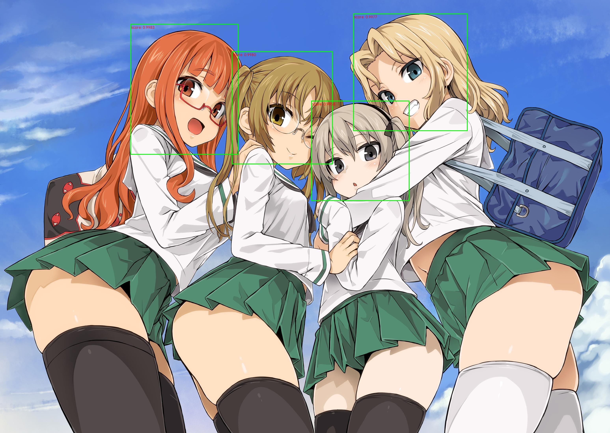
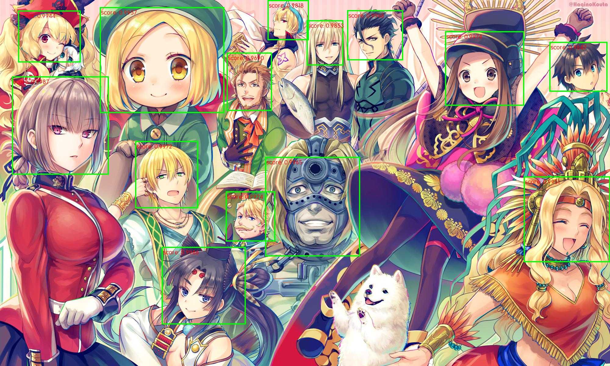
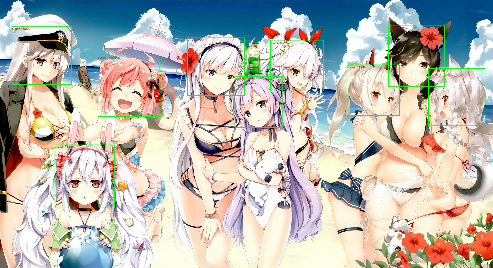
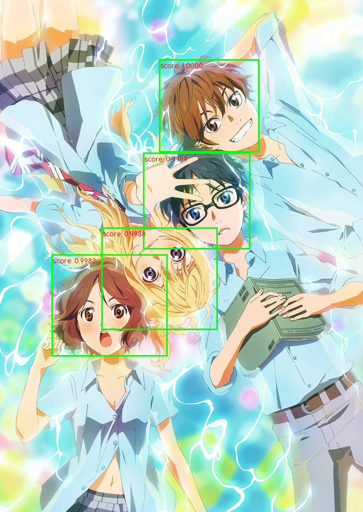
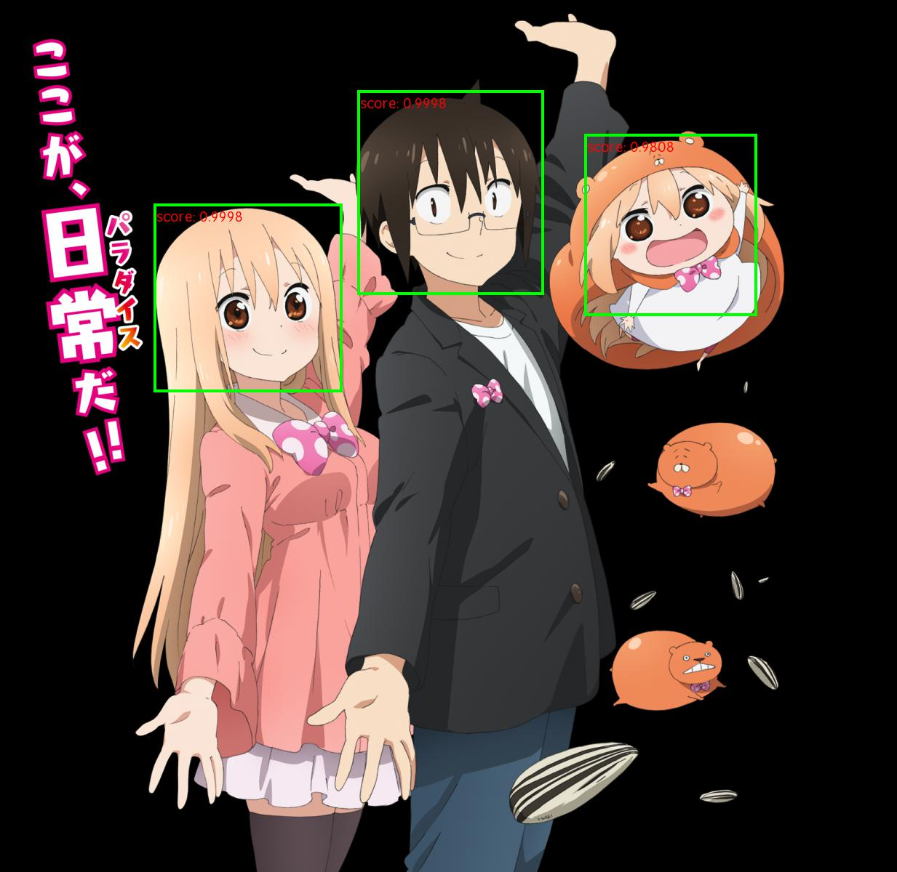

# Anime Head Detection





## 1. Dataset

All the images in the dataset are collected from [konachan.net](https://konachan.net/) and labeled by myself with [LabelImg](https://github.com/tzutalin/labelImg).
[Download dataset](https://pan.baidu.com/s/15kHbIEV9wAbN6FvTRY16Tg)

## 2. Usage

### 2.1 Requirements
* python 3.6
* pytorch 1.3.0
* torchvision 0.4.1
* opencv-python 3.4.1

### 2.2 Training

1. [Download dataset](https://pan.baidu.com/s/15kHbIEV9wAbN6FvTRY16Tg). Following are dataset directory trees and labeled file format.

``` 
    data
        imgs
            anime_0001.jpg
            anime_0002.jpg
            ...
        tr_label.csv
        val_label.csv
        ...
```
```
    file_name,xmin ymin xmax ymax label;...;xmin ymin xmax ymax label,img_width,img_height
```

2. run ``` python train.py ```

### 2.3 Detecting image

1. You can download [pretrained model weights](https://pan.baidu.com/s/1Mw9aulKGuFJesIsbcFfxhQ) and put into ``` checkpoints/weights ``` or train it by yourself. 
2. run ``` python detect_image.py your_image_path```
3. Example:



### 2.4 Detecting video
1. You can download [pretrained model weights](https://pan.baidu.com/s/1Mw9aulKGuFJesIsbcFfxhQ) and put into ``` checkpoints/weights ``` or train it by yourself. 
2. run ``` python detect_video.py your_video_path ```
3. Example:
[alt text](demo/tianshi.mp4)